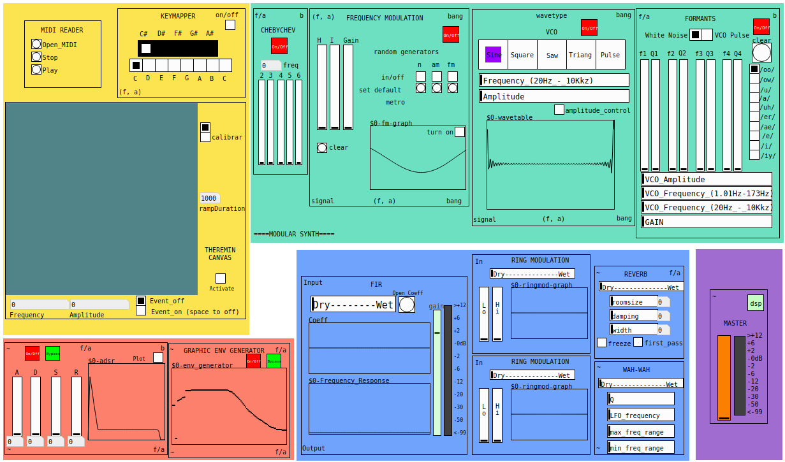

# Project for a Modular Synthesizer

Project for building a modular synthesizer as part of the Computer Music course from the Institute of Mathematics and Statistics, University of Sao Paulo.

By: [Mariana Jó](http://github.com/marianajo) and [Paulo Vitor de Itaboraí](http://github.com/itaborala)

Professor: Marcelo Queiroz

## Modules
The synthesizer uses thirteen modules: 3 for control, 4 for synthesis, 4 for effects and 2 for envelopes.

### Control
* MIDI file reader
* Theremin Canvas
* Keymapper

### Synthesis
* VCO
* Formants
* FM
* Chebychev Synthesis

### Effects
* FIR
* Reverb
* Ring Modulation
* Wah-wah

### Envelopes
* ADSR
* Graphic Envelope Generator

## Project structure

├── MAIN.pd - *The main patch. It's an interface to operate the synth with a cleaner look. It's just a way to have `modular-synths.pd` without wires*

├── modular-synths.pd - *The synthesizer itself, conecting all the modules*

├── README.md - *These instructions*

├── abs - *Directory with all the abstractions used by the patch*

│   ├── FIR_Files - *WAV files used by FIR effect*

│   ├── MIDI_Files - *MIDI files used as examples for the MIDI reader*

│   ├── README.md - *Instructions on how to use the abstractions [incomplete]*

## Dependencies

This patch was made using Pd-Vanilla.
- Flatgui
